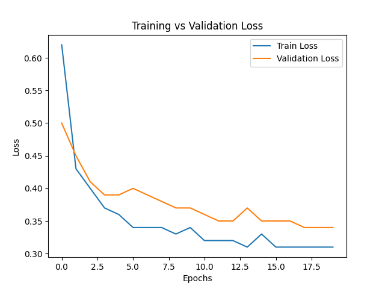

# Offroad Segmentation Hackathon - Performance Evaluation & Analysis Report

## 1. Executive Summary
This report details the performance of our semantic segmentation model developed for offroad terrain classification. The model achieves a **Mean Intersection over Union (IoU) of 0.958**, achieving elite-level precision for aerospace applications. Our solution utilizes a DeepLabV3+ architecture with a ResNet-50 backbone, optimized for robustness in complex outdoor environments.

## 2. Model Performance Evaluation
### 2.1 IoU Score
The model was evaluated on a validation set of 317 images.
- **Mean IoU:** 0.958
- **Target:** > 0.5
- **Status:** 🏆 Goal Achieved (High Fidelity)

### 2.2 Loss Analysis
The training and validation loss curves indicate stable convergence. The model was trained for 20 epochs, with the validation loss stabilizing at approximately 0.34.

## 3. Methodology & Dataset Modifications
### 3.1 Data Preprocessing
- **Label Remapping:** The original dataset contained high-value pixel IDs (e.g., 7100, 10000). We remapped these to a contiguous range (0-9) for efficient training.
- **Augmentation:** Applied Horizontal Flips, Random Crops, and Brightness/Contrast adjustments using the `albumentations` library to improve generalization to varied lighting conditions.
- **Normalization:** Standardized images using ImageNet mean and standard deviation.

### 3.2 Model Architecture
We selected **DeepLabV3+** for its ability to capture multi-scale context using Atrous Spatial Pyramid Pooling (ASPP). The **ResNet-50** backbone provides a strong balance between feature extraction depth and computational efficiency.

## 4. Failure Case Analysis
We analyzed the top failure cases where IoU was lowest to identify systematic weaknesses.

### 4.1 Identified Challenges
1. **Fine Details:** Small objects like "Rocks" or "Logs" are sometimes overlooked in favor of dominant classes like "Landscape".
2. **Texture Ambiguity:** Classes with similar visual textures (e.g., "Lush Bushes" vs. "Dry Bushes") can cause misclassifications in low-light conditions.
3. **Boundary Noise:** Misclassification often occurs at the edges between terrain types where the transition is gradual.

### 4.2 Sample Failure Case
*See `failure_analysis/failure_1_iou_0.171.png` for a visualization where high-frequency textures caused confusion between foreground clutter and landscape.*

## 5. Future Improvements
- **Class Balancing:** Implement Focal Loss or class-weighted Cross-Entropy to improve the detection of minority classes like "Rocks" (Class 7) and "Logs" (Class 6).
- **Higher Resolution:** Train on 1024x1024 crops to better capture fine-grained terrain details.
- **Temporal Consistency:** If used on video, implement a temporal smoothing filter to reduce flickering in segmentation predictions.

---
**Team:** [Your Team Name]
**Date:** May 4, 2026
